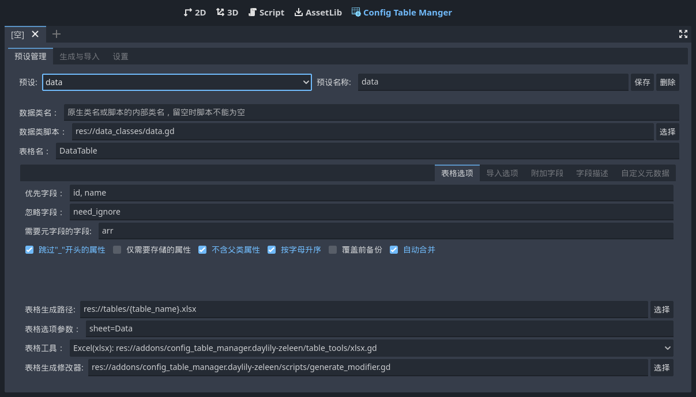
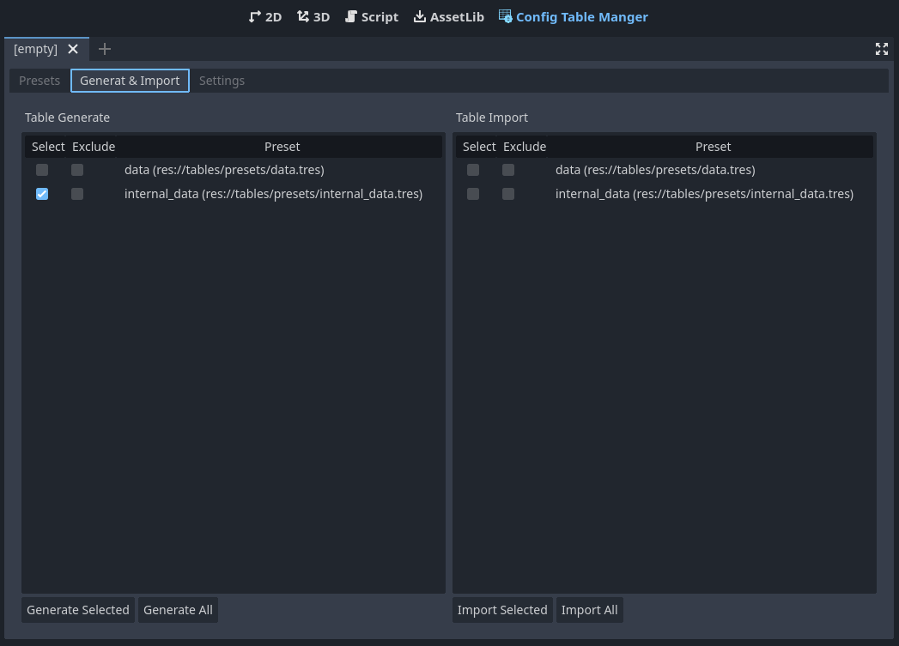
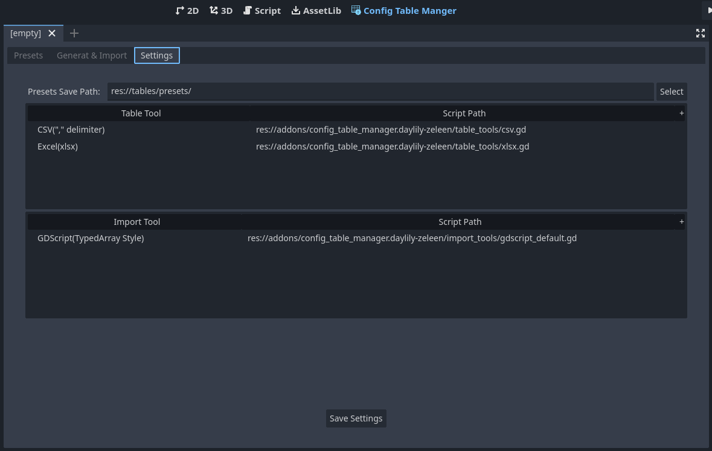

# Config Table Manager

一个用于管理配置表格的Godot插件

## 特性

1. 简单使用，根据数据类生成表头，允许添加附加列。
2. 生成与导入预设可保存，方便反复调节。
3. 支持重新生成表格时自动备份与合并。
4. 高度自定义，可添加自己的表格工具与导入工具，生成符合您需求的的表格文件或导入为你需要的资源格式。
5. 可添加生成修改器与导入修改器，在表格生成与导入流程中插入你的自定义逻辑以修改要生成或导入的数据。

## 概念

1. 预设(Preset)：
    描述表格如何生成和如何导入
2. 表格工具(Table Tool):
    用于解析表格和生成表格的工具脚本, 继承自 `res://addons/config_table_manager.daylily-zeleen/table_tools/table_tool.gd`。
3. 导入工具(Import Tool)
    用于导入表格, 继承自 `res://addons/config_table_manager.daylily-zeleen/import_tools/import_tool.gd`。
4. 生成修改器(Generate Modifier):
    用于在表格生成流程中插入自定义逻辑，以修改要生成的数据，这对程序化生成数据非常有用。继承自`res://addons/config_table_manager.daylily-zeleen/scripts/generate_modifier.gd`。
5. 导入修改器(Import Modifier):
    用于在导入流程中插入自定义逻辑，以修改要导入的数据，这对导入数据去重与后处理非常有用。继承自`res://addons/config_table_manager.daylily-zeleen/scripts/import_modifier.gd`。

## 如何开始

1. 下载并安装该插件，并再编辑器中启用，点击编辑器上方中间" Config Table Manager"按钮以显示该插件的UI。
2. 创建你的数据类脚本。
3. 在“预设管理”页面中创建你的预设，填写必要项目:
   1. `数据类脚本`选择你刚刚创建的脚本。
   2. 填写`表格名`。
   3. 填写`预设名称`，并点击“**保存**”。

   其他栏目均为进阶选项，如非必要无需修改。
   
4. 跳转到“生成与导入”页面，在左侧勾选你需要的预设进行生成（或全部生成），生成的表格默认在`res://tables/`路径下（默认生成CSV表格,**支持生成Excel(xlsx)**）。
   
5. 到外部编辑生成的csv表格(这里推荐使用VSCode并使用 "Edit csv" 插件进行编辑),注意使用utf8编码。
6. 回到编辑器中的“生成与导入”页面，在右侧勾选你需要的预设进行导入（或全部导入），导入的资源默认在`res://tables/imported/`路径下（默认导入为GDScript脚本）。
7. 现在你可以实例化有csv表格导入的GDScript脚本进行使用，具体请查看生成的脚本。

如有疑惑，请先在[Github页面上](https://github.com/Daylily-Zeleen/ConfigTableManager)下载该项目以查看示例配置。

## 内置工具

### 1. 表格工具

|表格工具|说明|选项参数|参数说明|
|-|-|-|-|
|CSV(,分隔)|解析与生成使用","分隔的csv表格|arr_dict_with_brackets|arr_dict_with_brackets：可选，如果指定，生成时将为数组和字典类型数值添加方/花括号|
|Excel(xlsx)|解析与生成xlsx，生成时如果指定文件已存在，仅对指定工作表进行覆盖|sheet=your_sheet_name；parse_sheet_must_exists；arr_dict_with_brackets|sheet:**必选**，指定该预设对应的工作表；parse_sheet_must_exists: 可选，如果使用该参数，解析时如果不存在指定工作表将发生解析错误。arr_dict_with_brackets：可选，如果指定，生成时将为数组和字典类型数值添加方/花括号|

### 2. 导入工具

|导入工具|说明|选项参数|参数说明|
|-|-|-|-|
|默认GDScript导入|将表格数据导入为GDScript（适合**数据量小**的场合）|generate_class_name|可选，如果有该选项且预设指定table_name是合法的标识符，则使用table_name生成全局类名(class_name)|

## 自定义工具

### 表格工具与导入工具

   

1. 扩展`res://addons/config_table_manager.daylily-zeleen/table_tools/table_tool.gd`并重写其中的虚方法以实现你的表格工具，用于解析和生成符合你需求的表格。将该脚本添加到设置中，它将出现在“预设管理”页面以供使用。
2. 扩展`res://addons/config_table_manager.daylily-zeleen/import_tools/import_tool.gd`并重写其中的虚方法以实现你的导入，用于生成符合你需求的导入资源。将该脚本添加到设置中，它将出现在“预设管理”页面以供使用。

### 自定义生成修改器与导入修改器

1. 扩展`res://addons/config_table_manager.daylily-zeleen/scripts/generate_modifier.gd`并重写其中的虚方法以实现你的生成修改器。
2. 扩展`res://addons/config_table_manager.daylily-zeleen/scripts/import_modifier.gd`并重写其中的虚方法以实现你的导入修改器。

修改器是针对某一预设起作用，为了让你的预设应用修改器，需要在预设的`生成选项`与`导入选项`中“表格生成修改器”与“表格导入修改器”栏目中选择你的修改器脚本（记得保存预设）。

## 欢迎提交你的表格工具与导入工具

欢迎提交你的表格工具与导入工具（置于`res://addons/config_table_manager.daylily-zeleen/table_tools/`与`res://addons/config_table_manager.daylily-zeleen/import_tools/`下）,丰富该插件的多样性。

也欢迎提交任何修复和改进。

## 如果这个插件对你有帮助，请点个Star或并考虑为我[充电](https://afdian.net/a/Daylily-Zeleen)

## TODO

1. 添加C#导入工具（目前本人没这个需求，等待有缘人贡献，或者等我有空了再添加）
2. 英文本地化
